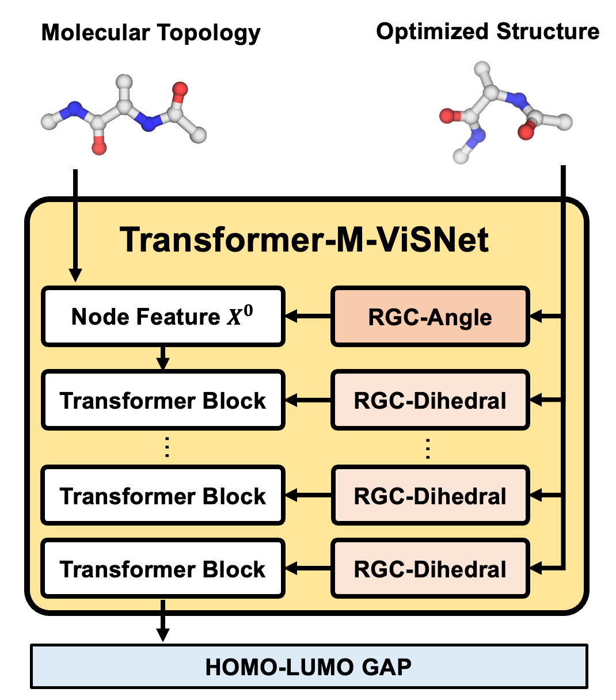

# Transformer-M-ViSNet

This branch of the repository is the official implementation of Transformer-M-ViSNet based on the official implementation of [Transformer-M](https://github.com/lsj2408/Transformer-M.git) and [Pytorch-Lightning](https://www.pytorchlightning.ai/).

## Overview



Transformer-M-ViSNet (short for Vector-Scalar interaction based on Transformer-M) is an improved version of [Transformer-M](https://arxiv.org/pdf/2210.01765.pdf) to better extract and exploit the geometric information with powerful vector-scalar interactive operations derived from [ViSNet](https://arxiv.org/pdf/2210.16518.pdf) for fully connected molecular graphs.

With comprehensively employing the geometric features embedded in 3D molecular structures, Transformer-M-ViSNet instructs the prediction of homo-lumo gap of molecules from their topology graphs.

## Installation

- Clone this repository (Branch: Transformer-M-ViSNet)

```shell
git clone https://github.com/microsoft/ViSNet.git -b Transformer-M-ViSNet
```

- Install the dependencies

```shell
conda create -y -n transformer-m-visnet python=3.9
conda activate transformer-m-visnet
conda install pytorch==1.11.0 torchvision==0.12.0 torchaudio==0.11.0 cudatoolkit=11.3 -c pytorch
conda install pyg -c pyg
pip install pytorch-lightning==1.5.10
pip install rdkit-pypi==2021.9.2.1
pip install ogb cython networkx
cd ViSNet
python setup_cython.py build_ext --inplace
```

- For faster training install NVIDIA's apex library, but we recommend using the native AMP in Pytorch:
```shell
git clone https://github.com/NVIDIA/apex
cd apex
pip install -v --disable-pip-version-check --no-cache-dir --global-option="--cpp_ext" --global-option="--cuda_ext" ./
```

## Results

| Model                      | # of Parameters | Valid MAE on PCQM4Mv2 |
| :------------------------: | :-------------: | :-------------------: |
| Transformer-M-ViSNet (L12) | 60,723,524      | 0.07708               |              

## Validation

To reproduce our results on the validation set, run:

```shell
CUDA_VISIBLE_DEVICES=0 python train.py --conf examples/Transformer-M-ViSNet.yaml --load-model checkpoints/L12.ckpt --dataset-root data --log-dir results --task inference --inference-dataset valid
```

## Training

To train our Transformer-M-ViSNet from scratch, we recommend using the default setting on 4 NVIDIA A100s. The time cost for the whole training process is around 4 days.

```shell
CUDA_VISIBLE_DEVICES=0,1,2,3 python train.py --conf examples/Transformer-M-ViSNet.yaml --dataset-root data --log-dir logs --task train
```

## Citation

If you find this work useful, please kindly cite following papers:

```latex
@article{wang2022visnet,
  title={ViSNet: a scalable and accurate geometric deep learning potential for molecular dynamics simulation},
  author={Wang, Yusong and Li, Shaoning and He, Xinheng and Li, Mingyu and Wang, Zun and Zheng, Nanning and Shao, Bin and Wang, Tong and Liu, Tie-Yan},
  journal={arXiv preprint arXiv:2210.16518},
  year={2022}
}

@article{luo2022one,
  title={One Transformer Can Understand Both 2D \& 3D Molecular Data},
  author={Luo, Shengjie and Chen, Tianlang and Xu, Yixian and Zheng, Shuxin and Liu, Tie-Yan and Wang, Liwei and He, Di},
  journal={arXiv preprint arXiv:2210.01765},
  year={2022}
}
```

## Contact

Please contact Tong Wang (watong@microsoft.com) for technical support.

## License

This project is licensed under the terms of the MIT license. See [LICENSE](https://github.com/microsoft/ViSNet/blob/Transformer-M-ViSNet/LICENSE) for additional details.
